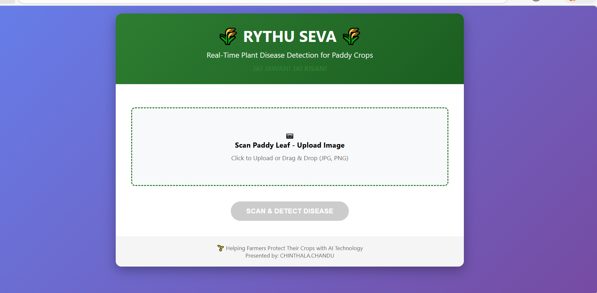
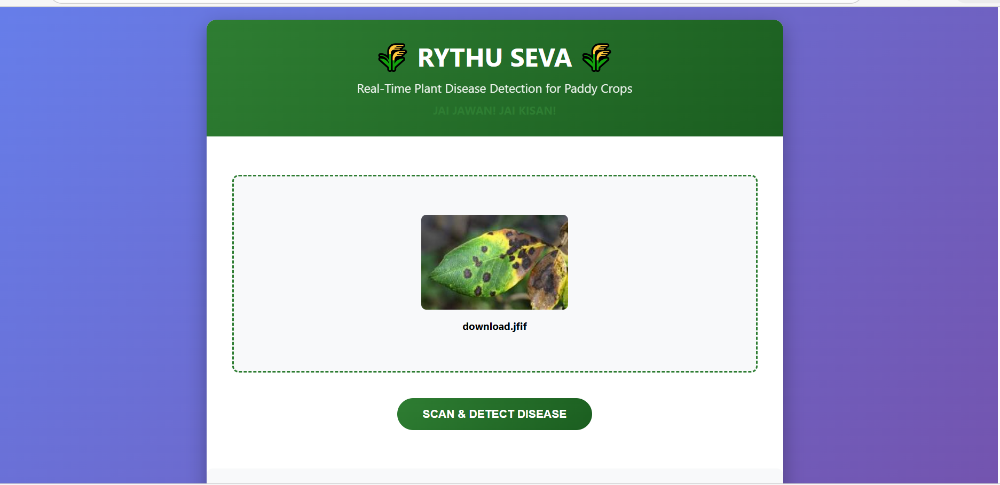
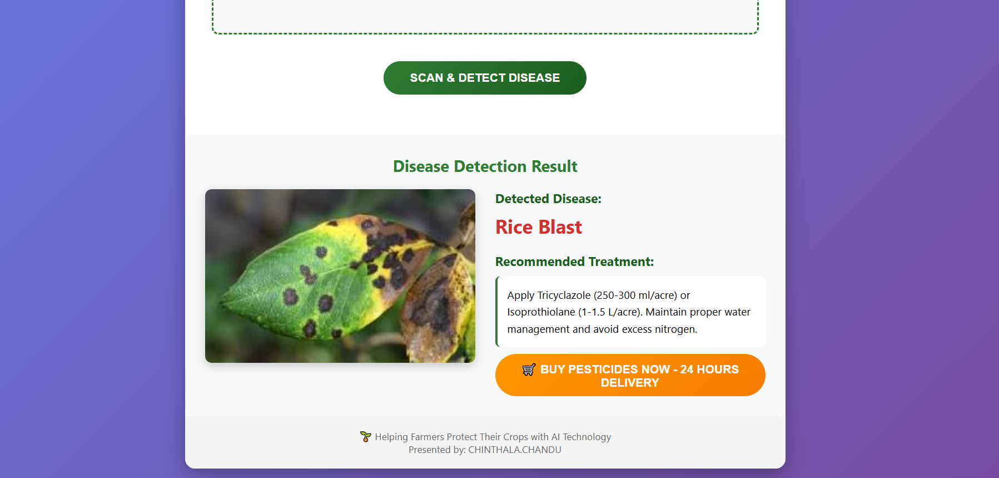

# Plant Disease Detection System
This project is an AI-based system designed to detect plant diseases from leaf images using deep learning techniques. The application allows users to upload an image of a plant leaf, after which the system analyzes the image and predicts the possible disease affecting the plant.

The goal of this project is to assist farmers and agricultural researchers in identifying plant diseases early so that appropriate treatment measures can be taken.

## Project Overview
Plant diseases can significantly affect crop production. Early detection is important to prevent the spread of diseases and improve crop yield. This project uses computer vision and deep learning to analyze leaf images and classify plant diseases automatically.

A trained deep learning model built using TensorFlow processes the uploaded image and returns the predicted disease. The system is implemented using Flask for the backend and HTML/CSS for the user interface.

## Technologies Used
* Python
* TensorFlow
* Flask
* OpenCV
* HTML
* CSS

## Features
* Upload plant leaf images for analysis
* Deep learning model predicts the plant disease
* Displays prediction results to the user
* Provides basic treatment suggestions
* Simple and easy-to-use web interface

## Project Structure
plant-disease-detector
│
├── backend/
│   ├── app.py
│   ├── models/
│   ├── templates/
│   └── static/
│
├── screenshots/
│   ├── home.png
│   ├── upload.png
│   └── result.png
│
├── README.md
└── requirements.txt

## Screenshots
### Home Page

### Upload Page

### Result Page

## Requirements
To run this project locally, make sure the following are installed:
* Python 3.8 or higher
* pip package manager

Required Python libraries include:

* Flask
* TensorFlow
* OpenCV
* NumPy
* Pillow

## Installation
1. Clone the repository
git clone https://github.com/PadalaAbhinay/plant-disease-detector.git

2. Navigate to the project directory
cd plant-disease-detector/backend

3. Install the required dependencies
pip install -r requirements.txt

4. Run the application
python app.py

5. Open your browser and visit
http://127.0.0.1:5000
 
# Future Improvements
* Integration with mobile applications
* Expanding the dataset to include more plant diseases
* Real-time detection using a camera
* Deployment on cloud platforms for public access
